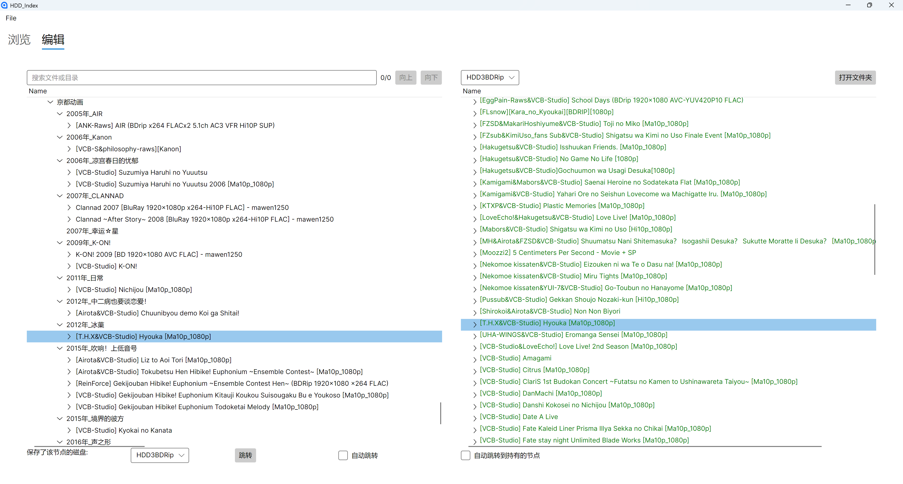
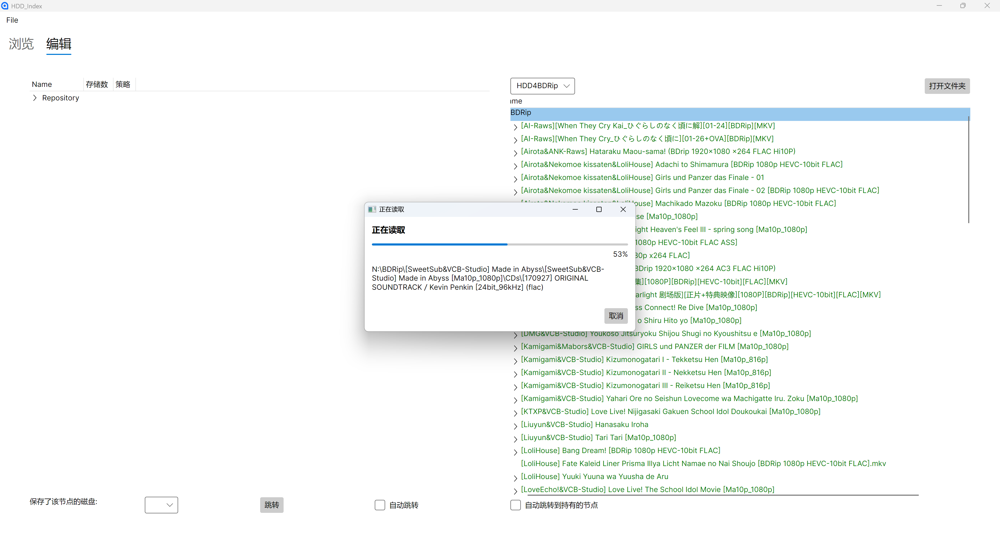
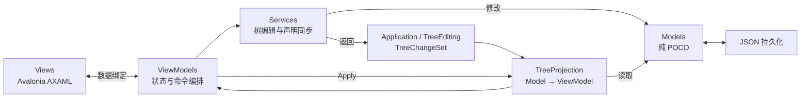

# HDD-Index-Avalonia

HDD Index 是一个基于 C#、.NET 9 和 Avalonia 的桌面端离线磁盘目录索引工具。

它通过两类树帮助用户整理分散在多块磁盘中的文件：

- **Repository 树**：用户定义的虚拟分类目录，表示希望如何组织内容。
- **File 树**：扫描真实文件夹得到的目录快照，表示内容实际存放在哪块磁盘。

两棵树之间可以建立“声明持有”关系。即使磁盘当前没有连接，也可以通过保存的 JSON 索引浏览目录及其归档位置。

## 主要功能

- 扫描本地文件夹并创建磁盘文件树索引。
- 管理多块磁盘，通过磁盘标签切换索引。
- 浏览、搜索和编辑虚拟 Repository 树。
- 在 Repository 节点和真实文件节点之间双向跳转。
- 创建、重命名、复制和删除 Repository 节点。
- 局部刷新文件树，支持扫描进度、取消和跳过已保存子树。
- 使用默认或 BDRip 策略验证声明持有关系。
- 自动维护 Repository 与 File 节点之间的双向关联。
- 追踪发生修改的 JSON，并在保存或退出时处理未保存内容。
- 首次启动时创建配置和空 Repository，并在数据迁移后引导修复路径。
- 隔离单个缺失或损坏的磁盘索引，让其他索引继续可用。
- 使用逐文件原子写入保存 JSON，写入失败时保留旧文件。
- 在 Windows 资源管理器中打开真实文件位置。

## 截图





## 下载与升级

Windows 用户可以从 [GitHub Releases](https://github.com/maodlife/HDD-Index-Avalonia/releases) 下载 `HDD-Index-<版本tag>-win-x64.zip`。发布包为自包含版本，通常不需要另外安装 .NET。

解压后运行 `HDD-Index.exe`。当前发布包未进行代码签名，因此 Windows SmartScreen 可能显示未知发布者提示。

升级前请先阅读：

- [数据目录说明](docs/data-directory.md)
- [升级说明](docs/upgrading.md)

维护者创建版本参见[发布流程](docs/releasing.md)。

## 技术栈

- .NET 9
- Avalonia 11
- ReactiveUI
- CommunityToolkit.Mvvm
- Avalonia TreeDataGrid
- System.Text.Json
- xUnit

## 架构概览

Model 是唯一业务数据源，并保持为纯 POCO。编辑服务只修改 Model，同时返回 `TreeChangeSet`；`TreeProjection` 根据这些变化定点更新轻量 ViewModel。



详细的分层结构、编辑时序和依赖约束参见 [架构文档](docs/architecture.md)。

## 项目规划

当前工程阶段、完成证据和下一阶段方向统一记录在[项目路线图](docs/roadmap.md)中。

## 配置

首次运行且默认配置不存在时，应用会显示启动设置窗口。选择一个数据文件夹后，它会创建默认配置、`RepoTreeData.json` 和空的 `Repository` 根节点；如果所选目录已经有同名 Repository 文件，应用会拒绝覆盖。

配置指向的数据目录或 Repository 迁移后，可在启动窗口重新选择数据目录。应用会先验证新位置，成功后才写回配置。单个磁盘索引缺失、损坏或不可读时会被本次会话隔离，其他索引仍可使用；主窗口会列出被跳过的实际文件，保存时不会触及它们。

默认配置文件路径：

```text
用户文档/HDD-Index/config.json
```

示例：

```json
{
  "JsonFilePath": "C:\\Users\\example\\Documents\\HDD-Index\\Data",
  "RepoFileName": "RepoTreeData.json",
  "FileDataFiles": [
    {
      "JsonFilePath": "HDD1BDRip.json",
      "LocalFolderPath": "L:\\BDRip"
    },
    {
      "JsonFilePath": "HDD3BDRip.json",
      "LocalFolderPath": "M:\\BDRip"
    }
  ]
}
```

字段说明：

- `JsonFilePath`：Repository 和各磁盘索引 JSON 所在目录。
- `RepoFileName`：Repository 树的 JSON 文件名。
- `FileDataFiles[].JsonFilePath`：相对于 `JsonFilePath` 的磁盘索引文件名。
- `FileDataFiles[].LocalFolderPath`：索引对应的真实本地目录。

真实本地目录移动或盘符变化后，在主界面的磁盘索引区域选择对应标签并点击“修复路径”。这只更新配置中的 `LocalFolderPath`，不会重新扫描或覆盖现有索引。

配置、Repository 和每个磁盘索引都会先完整写入同目录临时文件并刷新，再原子替换目标。该保证以单个 JSON 为单位；一次保存涉及多个 JSON 时，它们之间不构成全局事务。

## 构建与测试

在仓库根目录执行与 CI 等价的完整检查：

```powershell
dotnet restore HDD-Index/HDD-Index.sln
dotnet format HDD-Index/HDD-Index.sln --verify-no-changes --no-restore --verbosity minimal
dotnet build HDD-Index/HDD-Index.sln --configuration Release --no-restore -warnaserror
dotnet test HDD-Index/HDD-Index.sln --configuration Release --no-build --no-restore --verbosity normal
```

Avalonia UI 本身支持跨平台，但当前“在文件夹中打开”等功能直接调用 Windows Explorer，因此完整功能目前面向 Windows。
