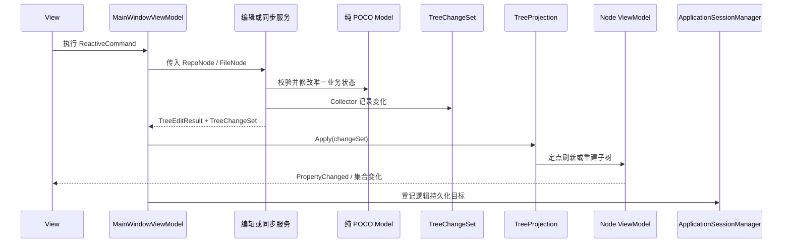
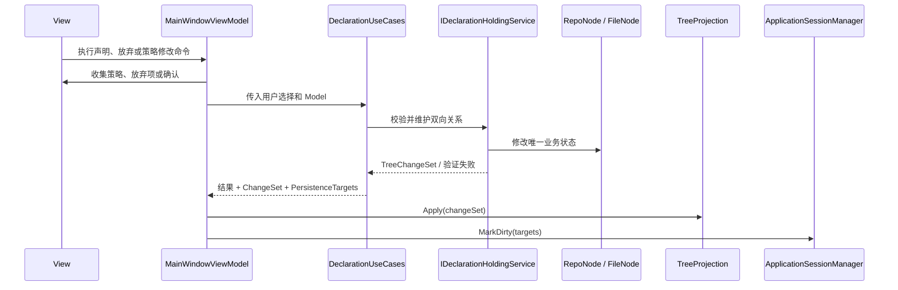
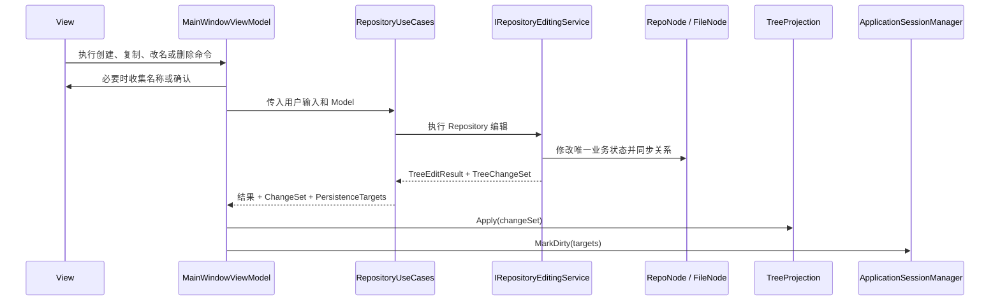
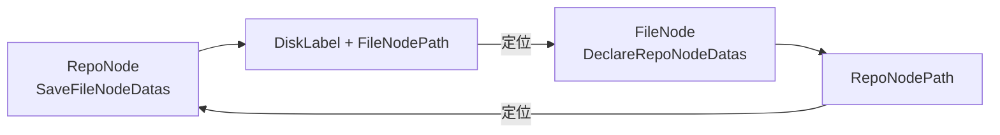

# HDD Index 架构

本文档描述当前代码已经实现的架构、运行时数据流和维护约束。它不代表未来规划。

## 设计目标

当前架构围绕以下原则组织：

- Model 是唯一业务数据源。
- Model 保持为纯 POCO，不承担 UI 通知职责。
- Services 只操作 Model，不依赖 ViewModel。
- 业务操作通过 `TreeChangeSet` 描述需要更新的投影。
- ViewModel 只保留展示数据、树节点包装和 UI 状态。
- 脏文件追踪与 UI 投影变化相互独立。
- 现有 JSON 数据格式保持向后兼容。

## 整体架构

```mermaid
flowchart TB
    subgraph Bootstrap["启动与组合"]
        Program["Program<br/>Avalonia 启动"]
        App["App<br/>手工组合根"]
        MainWindow["MainWindow"]
        Program --> App --> MainWindow
    end

    subgraph Presentation["表现层"]
        Views["Views / Dialogs<br/>AXAML 界面"]
        MainVM["MainWindowViewModel<br/>应用编排入口"]
        BrowserVM["RepoBrowserViewModel<br/>FileBrowserViewModel"]
        NodeVM["RepoNodeVM / FileNodeVM<br/>轻量 Model 包装器"]
        Navigation["TreeNavigationService<br/>搜索、定位、展开"]
        Projection["TreeProjection<br/>会话级 Model → VM 投影"]

        MainWindow --> Views
        Views <-->|"绑定 / ReactiveCommand"| MainVM
        MainVM --> BrowserVM
        BrowserVM --> NodeVM
        MainVM --> Navigation
        Navigation --> NodeVM
        Projection --> NodeVM
    end

    subgraph Application["Application"]
        EditResult["TreeEditResult&lt;T&gt;<br/>操作结果"]
        ChangeSet["TreeChangeSet<br/>不可变变更集合"]
        Collector["TreeChangeCollector<br/>内部累积变化"]
        TreeChanges["TreeChange<br/>NodeAdded / NodeRemoved<br/>PresentationChanged / SubtreeReplaced"]
        ScanContract["FileScanning<br/>请求、进度、结果与问题契约"]
        InteractionPorts["ExternalInteractions<br/>消息、领域对话、扫描进度、路径端口"]
        DeclarationUseCases["Declarations<br/>声明、放弃、策略修改用例"]
        DeclarationPort["IDeclarationHoldingService<br/>声明领域操作端口"]
        RepositoryUseCases["Repositories<br/>创建、复制、改名、删除用例"]
        RepositoryPort["IRepositoryEditingService<br/>Repository 编辑端口"]
        Session["ApplicationSession<br/>共享会话 Model"]
        SessionManager["ApplicationSessionManager<br/>逻辑脏目标与保存编排"]
        SessionStorePort["IApplicationSessionStore<br/>会话持久化端口"]

        Collector --> ChangeSet
        ChangeSet --> TreeChanges
        EditResult --> ChangeSet
        DeclarationUseCases --> DeclarationPort
        DeclarationUseCases --> ChangeSet
        RepositoryUseCases --> RepositoryPort
        RepositoryUseCases --> ChangeSet
        SessionManager --> Session
        SessionManager --> SessionStorePort
    end

    subgraph Adapters["外部适配器"]
        AvaloniaAdapters["Avalonia Adapters<br/>对话框、文件夹选择、扫描进度"]
        ExplorerAdapter["WindowsExplorerPathOpener<br/>Windows 路径打开"]
    end

    subgraph Services["业务与应用服务"]
        RepoEditor["RepoTreeEditor<br/>创建、改名、删除、复制"]
        FileEditor["FileTreeEditor<br/>删除文件树节点"]
        Declaration["DeclarationSyncService<br/>声明持有与双向同步"]
        SessionStore["JsonApplicationSessionStore<br/>会话加载与保存"]
        DataStore["TreeDataStore<br/>树数据持久化"]
        ConfigService["AppConfigService<br/>配置持久化"]
        Scanner["FileTreeScanner<br/>本地目录扫描"]

        RepoEditor --> Declaration
        FileEditor --> Declaration
        RepoEditor --> Collector
        FileEditor --> Collector
        Declaration --> Collector
        Scanner --> ScanContract
        SessionStore --> DataStore
        SessionStore --> ConfigService
    end

    subgraph Domain["Models / 领域数据"]
        TreeBase["TreeNodeBase<br/>Parent / Children / Name / Path"]
        RepoNode["RepoNode<br/>虚拟仓库树"]
        FileNode["FileNode<br/>真实磁盘索引树"]
        Relations["SaveFileNodeData<br/>DeclareRepoNodeData"]
        Strategy["DeclareHoldingStrategy<br/>Default / BDRip"]
        FileData["FileData<br/>标签、本地路径、文件树"]
        AppConfig["AppConfig<br/>JSON 文件配置"]

        TreeBase --> RepoNode
        TreeBase --> FileNode
        RepoNode --> Relations
        FileNode --> Relations
        Declaration --> Strategy
        FileData --> FileNode
    end

    subgraph External["外部资源"]
        LocalFS["本地文件系统"]
        ConfigJSON["config.json"]
        RepoJSON["Repository JSON"]
        FileJSON["各磁盘 File Tree JSON"]
        Explorer["Windows Explorer"]
    end

    MainVM --> FileEditor
    MainVM --> Declaration
    MainVM --> DeclarationUseCases
    MainVM --> RepositoryUseCases
    MainVM --> SessionManager
    MainVM --> Scanner
    MainVM --> InteractionPorts

    App --> MainVM
    App --> SessionStore
    App --> SessionManager
    App --> AvaloniaAdapters
    App --> ExplorerAdapter
    AvaloniaAdapters --> InteractionPorts
    AvaloniaAdapters --> Views
    ExplorerAdapter --> InteractionPorts
    SessionStore -. "实现" .-> SessionStorePort
    Declaration -. "实现" .-> DeclarationPort
    RepoEditor -. "实现" .-> RepositoryPort
    Session --> AppConfig
    Session --> RepoNode
    Session --> FileData

    RepoEditor --> RepoNode
    FileEditor --> FileNode
    Declaration --> RepoNode
    Declaration --> FileNode

    MainVM -. "应用 ChangeSet" .-> Projection
    ChangeSet -. "投影变化" .-> Projection
    Projection -. "读取唯一业务状态" .-> RepoNode
    Projection -. "读取唯一业务状态" .-> FileNode
    NodeVM -. "直接读取，不复制" .-> RepoNode
    NodeVM -. "直接读取，不复制" .-> FileNode

    LocalFS -->|"枚举目录"| Scanner
    Scanner -->|"创建扫描结果"| FileNode
    ConfigService <-->|"读写"| ConfigJSON
    DataStore <-->|"读写"| RepoJSON
    DataStore <-->|"读写"| FileJSON
    DataStore --> RepoNode
    DataStore --> FileData
    ExplorerAdapter -->|"打开路径"| Explorer
```



## 目录职责

### `Models`

保存可序列化的领域数据和领域规则：

- `TreeNodeBase`
- `RepoNode`
- `FileNode`
- `FileData`
- `AppConfig`
- `DeclareHoldingStrategy`

这些类型不引用 Avalonia、ReactiveUI 或 ViewModels。`FileNode` 只保存文件树数据和声明关系，不再遍历本地文件系统。
`RepoNode` 和 `FileNode` 也不再调用 JSON 序列化器；反序列化和父引用恢复由持久化实现负责。

### `Application`

`Application/TreeEditing` 定义树编辑操作与 UI 投影之间的应用层协议：

- `TreeEditResult<T>`：操作是否成功、返回值、失败原因及 ChangeSet。
- `TreeChangeSet`：一次业务操作产生的不可变变化集合。
- `TreeChangeCollector`：复杂操作内部使用的可变变化收集器。
- `TreeNodeAdded`、`TreeNodeRemoved`：细粒度结构变化。
- `TreeNodePresentationChanged`：节点展示相关数据需要重新读取。
- `FileNodeSubtreeReplaced`：文件树刷新后的子树级替换。

这些类型不参与 JSON 序列化，也不包含 Avalonia 类型。

`Application/FileScanning` 定义文件扫描边界的 UI 无关协议：

- `IFileTreeScanner`：扫描服务入口。
- `FileTreeScanRequest`：根路径、当前子树和跳过声明子树选项。
- `FileTreeScanProgress`：顶层完成数量和当前路径。
- `FileTreeScanResult`：成功、取消、完整失败或局部失败状态。
- `FileTreeScanIssue`：阻断性问题或非阻断性警告。

`Application/ExternalInteractions` 定义表现编排使用的 UI 无关外部能力端口：

- `IUserInteraction`：普通消息和确认消息。
- `IRepositoryInteraction`：策略选择、放弃声明、重命名和删除确认。
- `IFileTreeInteraction`：文件树删除确认和新索引输入。
- `IFileTreeScanProgressRunner`：带进度与取消的后台扫描执行。
- `IPathOpener`：打开文件夹或在文件夹中定位路径。

`Application/Persistence` 定义一次运行期间共享的数据和持久化编排：

- `ApplicationSession`：持有配置、Repository 根和全部 File Tree，供服务和 ViewModel 共享同一组 Model 对象。
- `PersistenceTarget`：使用配置、Repository 或磁盘标签描述逻辑持久化目标，不把裸文件路径传播到业务命令。
- `ApplicationSessionManager`：登记脏目标、解析未保存文件列表，并按配置、Repository、File Tree 的稳定顺序保存；整批成功后才清除脏状态。
- `IApplicationSessionStore`：加载会话、解析目标文件路径和保存单个逻辑目标的 UI 无关端口。

`Application/Declarations` 定义声明持有命令的 UI 无关应用编排：

- `DeclarationUseCases`：执行建立声明、放弃声明，并以“计划、确认、应用”两阶段处理策略修改。
- `IDeclarationHoldingService`：用例调用的最小声明领域操作端口，由 `DeclarationSyncService` 实现。
- `DeclarationOperationResult`：统一返回失败原因、`TreeChangeSet` 和受影响的逻辑持久化目标。
- `DeclareHoldingStrategyChangePlan`：在不修改 Model 的前提下返回策略和验证失败列表，供展示层确认后再应用。

`Application/Repositories` 定义 Repository 编辑命令的 UI 无关应用编排：

- `RepositoryUseCases`：执行创建目录、复制 File 子树、重命名和删除，并以“计划、确认、应用”两阶段处理搜索删除。
- `IRepositoryEditingService`：用例调用的最小 Repository 编辑端口，由 `RepoTreeEditor` 实现。
- `RepositoryOperationResult`：统一返回失败原因、`TreeChangeSet`、建议保持选中的节点和受影响的逻辑持久化目标。
- `RepositorySearchDeletePlan`：在不修改 Model 的前提下冻结命中节点及其展示路径，供展示层确认后再应用。

### `Services`

服务分为四类：

- 编辑服务：`RepoTreeEditor`、`FileTreeEditor`。
- 关系同步：`DeclarationSyncService`。
- 持久化：`JsonApplicationSessionStore`、`TreeDataStore`、`AppConfigService`。
- 外部数据读取：`FileTreeScanner`。

树编辑和声明同步服务只接收 Model，并在修改完成后返回 ChangeSet。`RepoTreeEditor` 实现 Repository 用例使用的编辑端口；`DeclarationSyncService` 为声明用例提供双向关系维护和策略验证原语，也继续被 Repository/File Tree 编辑服务复用。`JsonApplicationSessionStore` 组合配置和树数据存储，创建共享会话；具体持久化服务直接读写 Model，不创建 ViewModel。

`FileTreeScanner` 通过最小的文件系统读取接口遍历本地目录。完整成功才返回可应用的 `FileNode` 根；取消、根失败或任何阻断性局部问题都不返回可应用树。隐藏属性读取失败作为非阻断性警告，目录符号链接和 Windows junction 作为阻断性问题。

### `Adapters`

实现 Application 层定义的外部交互端口：

- Avalonia 适配器负责创建具体对话框、调用文件夹选择器，以及显示带取消能力的扫描进度窗口。
- `WindowsExplorerPathOpener` 负责验证本地路径并启动 Windows Explorer。

适配器可以依赖端口、Views 和平台 API，但 ViewModels 不得反向依赖适配器。

### `ViewModels`

- `MainWindowViewModel`：收集用户选择和确认、调用应用用例与外部交互端口、应用 ChangeSet 和持久化目标，并维护窗口级扫描状态。
- `TreeProjection`：维护 Model 对象引用到节点 ViewModel 的会话级映射。
- `RepoNodeVM`、`FileNodeVM`：直接读取 Model 属性，只提供展示计算和变化通知。
- `RepoBrowserViewModel`、`FileBrowserViewModel`：管理选择、当前磁盘和 TreeDataGrid 数据源。
- `TreeNavigationService`：处理 ViewModel 树上的搜索、路径定位和展开。

`TreeProjection` 使用 Model 对象引用作为映射键。该身份只需要在一次应用运行期间稳定，不写入 JSON。

`App` 创建 JSON 会话存储并加载 `ApplicationSession`，再围绕同一组会话 Model 显式创建服务、投影、子 ViewModel 和外部适配器，通过构造函数注入 `MainWindowViewModel`。当前不使用依赖注入容器。

### `Views`

包含主窗口、对话框、行为和 AXAML。Views 通过数据绑定和 `ReactiveCommand` 与 ViewModels 交互，不直接调用业务服务。

## 树编辑时序



普通创建、删除和重命名操作使用细粒度变化。文件树刷新可能一次替换大量后代，因此使用 `FileNodeSubtreeReplaced`，保留刷新根节点的 ViewModel，仅重建其后代投影。

## 声明持有命令时序



策略修改先由用例生成不修改 Model 的 `DeclareHoldingStrategyChangePlan`。如果计划包含验证失败，展示层负责向用户确认；只有确认后才调用应用操作并删除失效的双向关系。用例不打开窗口，也不依赖 Avalonia。

## Repository 编辑命令时序



搜索删除先由用例生成不修改 Model 的 `RepositorySearchDeletePlan`，其中包含命中节点和供确认窗口展示的路径。展示层确认后才应用删除。创建、重命名和删除会返回 Repository 及当前全部 File Tree 持久化目标；复制 File 子树只返回 Repository 目标。搜索刷新、节点选择和路径导航仍由 ViewModel 维护。

## Repository 与 File 双向关系



`DeclarationSyncService` 负责保证两边关系一致。`DeclarationUseCases` 将前三项组织成用户命令，`RepositoryUseCases` 通过 `RepoTreeEditor` 处理 Repository 改名和删除，后续 File Tree 用例将负责刷新后的重新验证：

- 建立声明持有关系。
- 放弃声明持有关系。
- 修改验证策略。
- Repository 节点改名后的路径更新。
- 删除节点后的关联清理。
- 文件树刷新后的关系重新验证。

## 持久化

系统不使用数据库，数据存放在 JSON 文件中：

```text
用户文档/HDD-Index/config.json
             │
             ├── Repository 树 JSON
             ├── 磁盘 A 的 File Tree JSON
             ├── 磁盘 B 的 File Tree JSON
             └── 各索引对应的本地目录
```

`ApplicationSessionManager` 记录发生变化的逻辑目标，并由 `IApplicationSessionStore` 将目标解析为具体 JSON 路径。保存时依次处理配置、Repository 和会话中的 File Tree；只有整批保存成功才清除脏目标，失败时保留整批目标供再次保存。声明和 Repository 用例的结果已经携带对应持久化目标；尚未拆分的 File Tree 命令仍由 ViewModel 决定目标。该机制不提供原子写入或多文件事务。

## 依赖约束

后续修改应保持以下规则：

1. `Models` 不得引用 Avalonia、ReactiveUI 或 ViewModels。
2. `Models` 不得通过 `File`、`Directory` 等类型直接访问本地文件系统。
3. `Models` 不得调用 JSON 序列化器；兼容现有格式所需的声明性序列化特性可以保留。
4. `Services` 不得引用 ViewModels、Views 或 Adapters。
5. ViewModels 不得依赖具体 Views 或 Adapters，不得查找 `Application.Current` 或直接启动平台进程。
6. ViewModel 不得复制并独立维护可变业务数据。
7. 树编辑必须通过服务修改 Model，并返回 `TreeChangeSet`。
8. `ApplicationSession`、服务、投影和 ViewModel 必须共享同一组 Model 对象。
9. 脏目标登记与保存编排统一通过 `ApplicationSessionManager`，具体文件路径和 JSON I/O 由持久化实现负责。
10. 应用用例不得打开窗口；其业务结果应返回 ChangeSet、验证信息和受影响持久化目标。
11. `TreeProjection` 是节点结构从 Model 投影到 ViewModel 的统一入口。
12. UI 展开、选择、颜色和格式化等状态留在 ViewModel。
13. 外部交互契约必须保持 UI 无关，具体 Avalonia 或平台调用只放在 Adapters。
14. JSON 属性或结构发生变化时，必须处理旧数据兼容。
15. 新增跨层依赖时，应更新或通过架构依赖测试。

## 当前限制

- 没有依赖注入容器，应用依赖由 `App` 显式手工组合。
- 没有通用事务回滚、撤销或重做机制。
- 文件树扫描、后台执行和进度窗口已经分离，但扫描成功后的业务应用仍由 `MainWindowViewModel` 编排。
- 声明持有和 Repository 编辑命令已经使用独立用例，但 `MainWindowViewModel` 仍负责 File Tree 编辑用例编排，并为这些未拆分命令决定持久化目标。
- Avalonia UI 支持跨平台，但路径打开适配器当前是 Windows Explorer 专用实现。
- 应用启动依赖默认路径下已经存在有效配置和 Repository 数据文件。
