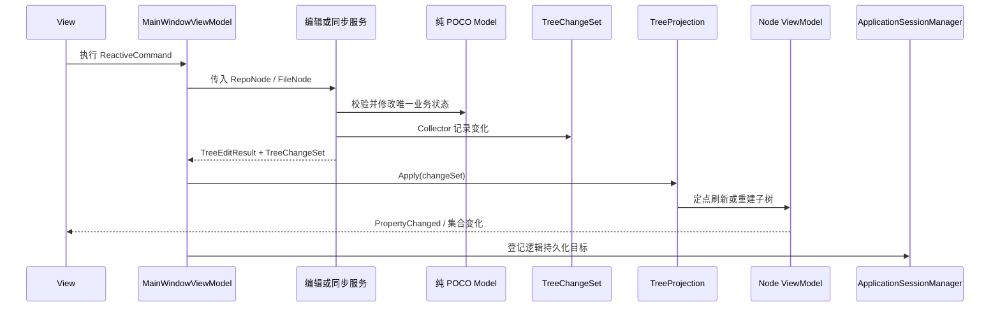
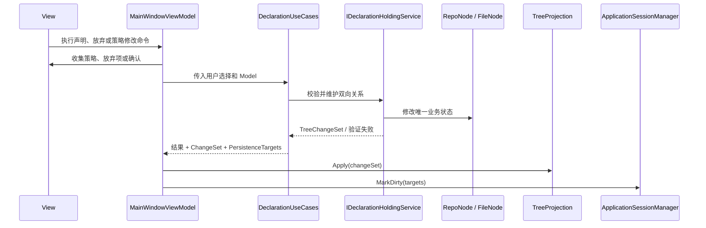
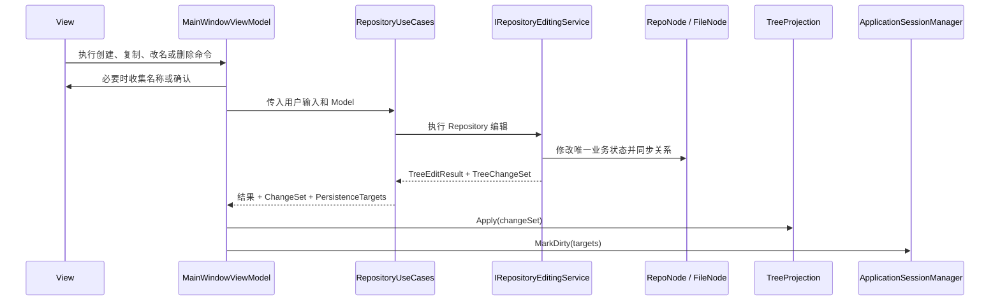
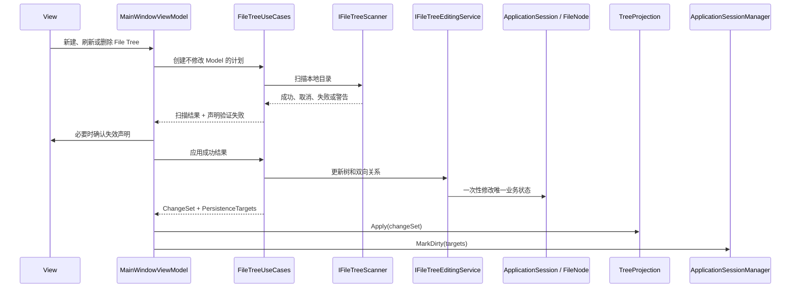
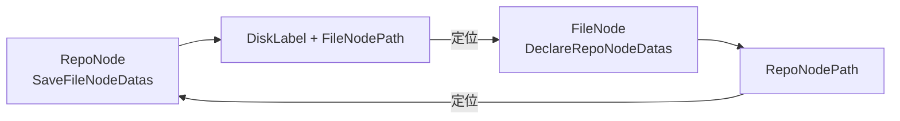
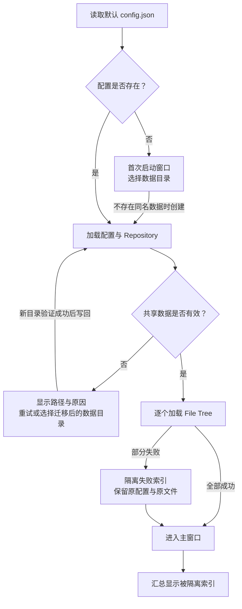

# HDD Index 架构

本文档描述当前代码已经实现的架构、运行时数据流和维护约束。它不代表未来规划。

## 设计目标

当前架构围绕以下原则组织：

- Model 是唯一业务数据源。
- Model 保持为纯 POCO，不承担 UI 通知职责。
- Services 只操作 Model，不依赖 ViewModel。
- 业务操作通过 `TreeChangeSet` 描述需要更新的投影。
- ViewModel 只保留展示数据、树节点包装和 UI 状态。
- 脏文件追踪与 UI 投影变化相互独立。
- 启动失败以强类型结果进入恢复界面，单个磁盘索引故障与共享会话故障分开处理。
- JSON 写入先落到同目录临时文件，再以逐文件原子操作发布。
- 现有 JSON 数据格式保持向后兼容。

## 整体架构

```mermaid
flowchart TB
    subgraph Bootstrap["启动与组合"]
        Program["Program<br/>Avalonia 启动"]
        App["App<br/>手工组合根"]
        StartupWindow["StartupWindow<br/>首次设置与故障恢复"]
        MainWindow["MainWindow"]
        Program --> App
        App --> StartupWindow
        App --> MainWindow
    end

    subgraph Presentation["表现层"]
        Views["Views / Dialogs<br/>AXAML 界面"]
        MainVM["MainWindowViewModel<br/>窗口级交互与导航"]
        StartupVM["StartupViewModel<br/>启动状态与恢复命令"]
        BrowserVM["RepoBrowserViewModel<br/>FileBrowserViewModel"]
        NodeVM["RepoNodeVM / FileNodeVM<br/>轻量 Model 包装器"]
        Navigation["TreeNavigationService<br/>搜索、定位、展开"]
        Projection["TreeProjection<br/>会话级 Model → VM 投影"]

        MainWindow --> Views
        Views <-->|"绑定 / ReactiveCommand"| MainVM
        StartupWindow <-->|"绑定 / Command"| StartupVM
        MainVM --> BrowserVM
        BrowserVM --> NodeVM
        MainVM --> Navigation
        Navigation --> NodeVM
        Projection --> NodeVM
    end

    subgraph Application["Application"]
        EditResult["TreeEditResult&lt;T&gt;<br/>操作结果"]
        ChangeSet["TreeChangeSet<br/>不可变变更集合"]
        Collector["TreeChangeCollector<br/>内部累积变化"]
        TreeChanges["TreeChange<br/>NodeAdded / NodeRemoved<br/>PresentationChanged / SubtreeReplaced"]
        ScanContract["FileScanning<br/>请求、进度、结果与问题契约"]
        InteractionPorts["ExternalInteractions<br/>消息、领域对话、扫描进度、路径端口"]
        DeclarationUseCases["Declarations<br/>声明、放弃、策略修改用例"]
        DeclarationPort["IDeclarationHoldingService<br/>声明领域操作端口"]
        RepositoryUseCases["Repositories<br/>创建、复制、改名、删除用例"]
        RepositoryPort["IRepositoryEditingService<br/>Repository 编辑端口"]
        FileTreeUseCases["FileTrees<br/>新建、刷新、删除、路径用例"]
        FileTreePorts["IFileTreeEditingService / IFileTreePathService"]
        Session["ApplicationSession<br/>共享会话 Model"]
        SessionManager["ApplicationSessionManager<br/>逻辑脏目标与保存编排"]
        SessionStorePort["IApplicationSessionStore<br/>会话持久化端口"]
        StartupContracts["Startup<br/>启动状态、诊断与恢复端口"]
        SessionLoadResult["SessionLoadResult<br/>共享故障与隔离警告"]

        Collector --> ChangeSet
        ChangeSet --> TreeChanges
        EditResult --> ChangeSet
        DeclarationUseCases --> DeclarationPort
        DeclarationUseCases --> ChangeSet
        RepositoryUseCases --> RepositoryPort
        RepositoryUseCases --> ChangeSet
        FileTreeUseCases --> FileTreePorts
        FileTreeUseCases --> ScanContract
        FileTreeUseCases --> ChangeSet
        SessionManager --> Session
        SessionManager --> SessionStorePort
        StartupContracts --> SessionLoadResult
    end

    subgraph Adapters["外部适配器"]
        AvaloniaAdapters["Avalonia Adapters<br/>对话框、文件夹选择、扫描进度"]
        ExplorerAdapter["WindowsExplorerPathOpener<br/>Windows 路径打开"]
    end

    subgraph Services["业务与应用服务"]
        RepoEditor["RepoTreeEditor<br/>创建、改名、删除、复制"]
        FileEditor["FileTreeEditor<br/>删除、刷新与关系同步适配"]
        PathService["FileTreePathService<br/>文件树路径与存在性"]
        Declaration["DeclarationSyncService<br/>声明持有与双向同步"]
        SessionStore["JsonApplicationSessionStore<br/>会话加载与保存"]
        StartupService["ApplicationStartupService<br/>首次创建与路径修复"]
        DataStore["TreeDataStore<br/>树数据持久化"]
        ConfigService["AppConfigService<br/>配置持久化"]
        AtomicWriter["AtomicFileWriter<br/>刷新临时文件并原子发布"]
        Scanner["FileTreeScanner<br/>本地目录扫描"]

        RepoEditor --> Declaration
        FileEditor --> Declaration
        RepoEditor --> Collector
        FileEditor --> Collector
        Declaration --> Collector
        Scanner --> ScanContract
        SessionStore --> DataStore
        SessionStore --> ConfigService
        StartupService --> SessionStore
        StartupService --> DataStore
        StartupService --> ConfigService
        DataStore --> AtomicWriter
        ConfigService --> AtomicWriter
    end

    subgraph Domain["Models / 领域数据"]
        TreeBase["TreeNodeBase<br/>Parent / Children / Name / Path"]
        RepoNode["RepoNode<br/>虚拟仓库树"]
        FileNode["FileNode<br/>真实磁盘索引树"]
        Relations["SaveFileNodeData<br/>DeclareRepoNodeData"]
        Strategy["DeclareHoldingStrategy<br/>Default / BDRip"]
        FileData["FileData<br/>标签、本地路径、文件树"]
        AppConfig["AppConfig<br/>JSON 文件配置"]

        TreeBase --> RepoNode
        TreeBase --> FileNode
        RepoNode --> Relations
        FileNode --> Relations
        Declaration --> Strategy
        FileData --> FileNode
    end

    subgraph External["外部资源"]
        LocalFS["本地文件系统"]
        ConfigJSON["config.json"]
        RepoJSON["Repository JSON"]
        FileJSON["各磁盘 File Tree JSON"]
        TempJSON["同目录临时 JSON"]
        Explorer["Windows Explorer"]
    end

    MainVM --> DeclarationUseCases
    MainVM --> RepositoryUseCases
    MainVM --> FileTreeUseCases
    MainVM --> SessionManager
    MainVM --> InteractionPorts

    App --> MainVM
    App --> StartupVM
    App --> StartupService
    App --> SessionStore
    App --> SessionManager
    App --> AvaloniaAdapters
    App --> ExplorerAdapter
    AvaloniaAdapters --> InteractionPorts
    AvaloniaAdapters --> Views
    ExplorerAdapter --> InteractionPorts
    SessionStore -. "实现" .-> SessionStorePort
    StartupService -. "实现" .-> StartupContracts
    Declaration -. "实现" .-> DeclarationPort
    RepoEditor -. "实现" .-> RepositoryPort
    FileEditor -. "实现编辑端口" .-> FileTreePorts
    PathService -. "实现路径端口" .-> FileTreePorts
    Session --> AppConfig
    Session --> RepoNode
    Session --> FileData

    RepoEditor --> RepoNode
    FileEditor --> FileNode
    Declaration --> RepoNode
    Declaration --> FileNode
    FileTreeUseCases --> Session

    MainVM -. "应用 ChangeSet" .-> Projection
    ChangeSet -. "投影变化" .-> Projection
    Projection -. "读取唯一业务状态" .-> RepoNode
    Projection -. "读取唯一业务状态" .-> FileNode
    NodeVM -. "直接读取，不复制" .-> RepoNode
    NodeVM -. "直接读取，不复制" .-> FileNode

    LocalFS -->|"枚举目录"| Scanner
    Scanner -->|"创建扫描结果"| FileNode
    ConfigService <-->|"读写"| ConfigJSON
    DataStore <-->|"读写"| RepoJSON
    DataStore <-->|"读写"| FileJSON
    AtomicWriter -->|"写入并刷新"| TempJSON
    TempJSON -->|"原子替换 / 移动"| ConfigJSON
    TempJSON -->|"原子替换 / 移动"| RepoJSON
    TempJSON -->|"原子替换 / 移动"| FileJSON
    DataStore --> RepoNode
    DataStore --> FileData
    ExplorerAdapter -->|"打开路径"| Explorer
```



## 目录职责

### `Models`

保存可序列化的领域数据和领域规则：

- `TreeNodeBase`
- `RepoNode`
- `FileNode`
- `FileData`
- `AppConfig`
- `DeclareHoldingStrategy`

这些类型不引用 Avalonia、ReactiveUI 或 ViewModels。`FileNode` 只保存文件树数据和声明关系，不再遍历本地文件系统。
`RepoNode` 和 `FileNode` 也不再调用 JSON 序列化器；反序列化和父引用恢复由持久化实现负责。

### `Application`

`Application/TreeEditing` 定义树编辑操作与 UI 投影之间的应用层协议：

- `TreeEditResult<T>`：操作是否成功、返回值、失败原因及 ChangeSet。
- `TreeChangeSet`：一次业务操作产生的不可变变化集合。
- `TreeChangeCollector`：复杂操作内部使用的可变变化收集器。
- `TreeNodeAdded`、`TreeNodeRemoved`：细粒度结构变化。
- `TreeNodePresentationChanged`：节点展示相关数据需要重新读取。
- `FileNodeSubtreeReplaced`：文件树刷新后的子树级替换。

这些类型不参与 JSON 序列化，也不包含 Avalonia 类型。

`Application/FileScanning` 定义文件扫描边界的 UI 无关协议：

- `IFileTreeScanner`：扫描服务入口。
- `FileTreeScanRequest`：根路径、当前子树和跳过声明子树选项。
- `FileTreeScanProgress`：顶层完成数量和当前路径。
- `FileTreeScanResult`：成功、取消、完整失败或局部失败状态。
- `FileTreeScanIssue`：阻断性问题或非阻断性警告。

`Application/ExternalInteractions` 定义表现编排使用的 UI 无关外部能力端口：

- `IUserInteraction`：普通消息和确认消息。
- `IRepositoryInteraction`：策略选择、放弃声明、重命名和删除确认。
- `IFileTreeInteraction`：文件树删除确认和新索引输入。
- `IFileTreeScanProgressRunner`：带进度与取消的后台扫描执行。
- `IPathOpener`：打开文件夹或在文件夹中定位路径。

`Application/Persistence` 定义一次运行期间共享的数据和持久化编排：

- `ApplicationSession`：持有配置、Repository 根和全部 File Tree，供服务和 ViewModel 共享同一组 Model 对象。
- `PersistenceTarget`：使用配置、Repository 或磁盘标签描述逻辑持久化目标，不把裸文件路径传播到业务命令。
- `ApplicationSessionManager`：登记脏目标、解析未保存文件列表，并按配置、Repository、File Tree 的稳定顺序保存；整批成功后才清除脏状态。
- `IApplicationSessionStore`：加载会话、解析目标文件路径和保存单个逻辑目标的 UI 无关端口。
- `SessionLoadResult`、`SessionLoadIssue`：区分阻断共享会话的故障与可隔离的 File Tree 警告，并携带问题类型、实际文件路径和磁盘标签。

`Application/Startup` 定义启动恢复的 UI 无关协议：

- `ApplicationStartupResult`：明确表示正常就绪、首次运行或阻断启动。
- `IApplicationStartupService`：加载默认会话、创建首次运行数据，以及验证并修复数据目录。

`Application/Declarations` 定义声明持有命令的 UI 无关应用编排：

- `DeclarationUseCases`：执行建立声明、放弃声明，并以“计划、确认、应用”两阶段处理策略修改。
- `IDeclarationHoldingService`：用例调用的最小声明领域操作端口，由 `DeclarationSyncService` 实现。
- `DeclarationOperationResult`：统一返回失败原因、`TreeChangeSet` 和受影响的逻辑持久化目标。
- `DeclareHoldingStrategyChangePlan`：在不修改 Model 的前提下返回策略和验证失败列表，供展示层确认后再应用。

`Application/Repositories` 定义 Repository 编辑命令的 UI 无关应用编排：

- `RepositoryUseCases`：执行创建目录、复制 File 子树、重命名和删除，并以“计划、确认、应用”两阶段处理搜索删除。
- `IRepositoryEditingService`：用例调用的最小 Repository 编辑端口，由 `RepoTreeEditor` 实现。
- `RepositoryOperationResult`：统一返回失败原因、`TreeChangeSet`、建议保持选中的节点和受影响的逻辑持久化目标。
- `RepositorySearchDeletePlan`：在不修改 Model 的前提下冻结命中节点及其展示路径，供展示层确认后再应用。

`Application/FileTrees` 定义 File Tree 命令的 UI 无关应用编排：

- `FileTreeUseCases`：验证新建与刷新输入，执行扫描，并在成功且经过展示层确认后应用新索引、刷新或删除。
- `IFileTreeEditingService`：封装删除、刷新及声明关系重新验证，由 `FileTreeEditor` 实现。
- `IFileTreePathService`：封装文件名校验、JSON 存在性与路径组合，由 `FileTreePathService` 实现。
- `NewFileTreePlan`、`FileTreeRefreshPlan`：在不修改 Model 的前提下固定扫描输入。
- `FileTreeRefreshScanResult`：携带扫描结果、待应用子树和声明验证失败，供展示层确认。
- `FileTreeOperationResult`：统一返回失败原因、`TreeChangeSet`、新增 `FileData` 与持久化目标。

### `Services`

服务分为四类：

- 编辑服务：`RepoTreeEditor`、`FileTreeEditor`。
- 关系同步：`DeclarationSyncService`。
- 持久化：`JsonApplicationSessionStore`、`TreeDataStore`、`AppConfigService`、`AtomicFileWriter`。
- 启动恢复：`ApplicationStartupService`。
- 外部数据与路径：`FileTreeScanner`、`FileTreePathService`。

树编辑和声明同步服务只接收 Model，并在修改完成后返回 ChangeSet。`RepoTreeEditor` 实现 Repository 用例使用的编辑端口；`FileTreeEditor` 实现 File Tree 用例使用的删除、刷新与关系同步端口；`DeclarationSyncService` 为声明用例提供双向关系维护和策略验证原语，也继续被 Repository/File Tree 编辑服务复用。`JsonApplicationSessionStore` 组合配置和树数据存储，创建共享会话；配置或 Repository 故障返回阻断问题，单个 File Tree 故障返回警告并继续加载其他索引。`ApplicationStartupService` 在其上组织首次创建和数据目录修复。具体持久化服务直接读写 Model，不创建 ViewModel。

`AppConfigService` 与 `TreeDataStore` 不直接覆盖目标 JSON，而是共用 `AtomicFileWriter`：在目标目录写入唯一临时文件、显式刷新，再对已有目标执行原子替换或对新目标执行同目录移动。任何发布失败都会保留旧目标，并尽力清理临时文件。

`FileTreeScanner` 通过最小的文件系统读取接口遍历本地目录。完整成功才返回可应用的 `FileNode` 根；取消、根失败或任何阻断性局部问题都不返回可应用树。隐藏属性读取失败作为非阻断性警告，目录符号链接和 Windows junction 作为阻断性问题。

### `Adapters`

实现 Application 层定义的外部交互端口：

- Avalonia 适配器负责创建具体对话框、调用文件夹选择器，以及显示带取消能力的扫描进度窗口。
- 启动与 File Tree 适配器分别为首次创建、数据目录修复和单个索引的本地目录修复提供文件夹选择能力。
- `WindowsExplorerPathOpener` 负责验证本地路径并启动 Windows Explorer。

适配器可以依赖端口、Views 和平台 API，但 ViewModels 不得反向依赖适配器。

### `ViewModels`

- `MainWindowViewModel`：收集用户选择和确认、调用应用用例与外部交互端口、应用 ChangeSet 和持久化目标，并维护窗口级扫描状态。
- `StartupViewModel`：把首次运行或阻断诊断转换为可重试、可创建或可修复的启动命令，不直接访问文件系统。
- `TreeProjection`：维护 Model 对象引用到节点 ViewModel 的会话级映射。
- `RepoNodeVM`、`FileNodeVM`：直接读取 Model 属性，只提供展示计算和变化通知。
- `RepoBrowserViewModel`、`FileBrowserViewModel`：管理选择、当前磁盘和 TreeDataGrid 数据源。
- `TreeNavigationService`：处理 ViewModel 树上的搜索、路径定位和展开。

`TreeProjection` 使用 Model 对象引用作为映射键。该身份只需要在一次应用运行期间稳定，不写入 JSON。

`App` 创建共用的原子写入器、JSON 会话存储和启动服务。启动就绪时，它围绕同一组会话 Model 显式创建服务、投影、子 ViewModel 和外部适配器；首次运行或阻断时先展示 `StartupWindow`，恢复成功后再切换到 `MainWindow`。当前不使用依赖注入容器。

### `Views`

包含主窗口、对话框、行为和 AXAML。Views 通过数据绑定和 `ReactiveCommand` 与 ViewModels 交互，不直接调用业务服务。

## 树编辑时序



普通创建、删除和重命名操作使用细粒度变化。文件树刷新可能一次替换大量后代，因此使用 `FileNodeSubtreeReplaced`，保留刷新根节点的 ViewModel，仅重建其后代投影。

## 声明持有命令时序



策略修改先由用例生成不修改 Model 的 `DeclareHoldingStrategyChangePlan`。如果计划包含验证失败，展示层负责向用户确认；只有确认后才调用应用操作并删除失效的双向关系。用例不打开窗口，也不依赖 Avalonia。

## Repository 编辑命令时序



搜索删除先由用例生成不修改 Model 的 `RepositorySearchDeletePlan`，其中包含命中节点和供确认窗口展示的路径。展示层确认后才应用删除。创建、重命名和删除会返回 Repository 及当前全部 File Tree 持久化目标；复制 File 子树只返回 Repository 目标。搜索刷新、节点选择和路径导航仍由 ViewModel 维护。

## File Tree 命令时序



新建和刷新使用“计划、扫描、应用”三阶段流程。计划和扫描均不修改 Model；取消、失败或用户拒绝删除失效声明时不会添加索引、替换子树或登记脏目标。普通刷新只保存当前 File Tree；刷新导致声明失效以及删除节点时，同时保存 Repository 和当前 File Tree。主 ViewModel 只维护扫描进度、提示、确认、选择和投影。

## Repository 与 File 双向关系



`DeclarationSyncService` 负责保证两边关系一致。`DeclarationUseCases` 将前三项组织成用户命令，`RepositoryUseCases` 通过 `RepoTreeEditor` 处理 Repository 改名和删除，`FileTreeUseCases` 通过 `FileTreeEditor` 处理 File Tree 删除和刷新后的重新验证：

- 建立声明持有关系。
- 放弃声明持有关系。
- 修改验证策略。
- Repository 节点改名后的路径更新。
- 删除节点后的关联清理。
- 文件树刷新后的关系重新验证。

## 启动与故障隔离



配置和 Repository 共同定义一次运行的共享会话，因此缺失、无效或不可读时必须停留在启动窗口。配置仍可读时，数据目录修复会先用候选路径完整加载 Repository，再原子写回 `JsonFilePath`；验证失败不会改动原配置。

File Tree 相互独立。`JsonApplicationSessionStore` 按配置逐个加载，记录缺失、无效或不可读的索引并跳过，健康索引仍加入 `ApplicationSession`。被隔离项继续留在 `AppConfig.FileDataFiles` 中，但不进入会话的 `FileDatas`，所以脏目标枚举和保存不会触及故障文件；新建索引也会拒绝复用其已配置标签。

真实本地目录不参与 JSON 索引加载，因为离线浏览是正常使用场景。迁移磁盘或盘符后，用户可在主界面为当前索引选择新的 `LocalFolderPath`；该修改只登记配置文件为脏目标。

## 持久化

系统不使用数据库，数据存放在 JSON 文件中：

```text
用户文档/HDD-Index/config.json
             │
             ├── Repository 树 JSON
             ├── 磁盘 A 的 File Tree JSON
             ├── 磁盘 B 的 File Tree JSON
             └── 各索引对应的本地目录
```

`ApplicationSessionManager` 记录发生变化的逻辑目标，并由 `IApplicationSessionStore` 将目标解析为具体 JSON 路径。保存时依次处理配置、Repository 和会话中的 File Tree；只有整批保存成功才清除脏目标，失败时保留整批目标供再次保存。声明、Repository 和 File Tree 用例的结果都携带对应持久化目标，ViewModel 只登记结果。

每个目标由 `AtomicFileWriter` 单独原子发布：临时文件与目标位于同一目录，内容写完并刷新到磁盘后才替换旧文件。这样单次写入失败不会留下被截断的目标 JSON，但多个目标之间仍不是一个事务；如果第三个文件失败，前两个已经成功发布的文件不会自动回滚，所有逻辑脏目标则继续保留以便用户重试。

## 依赖约束

后续修改应保持以下规则：

1. `Models` 不得引用 Avalonia、ReactiveUI 或 ViewModels。
2. `Models` 不得通过 `File`、`Directory` 等类型直接访问本地文件系统。
3. `Models` 不得调用 JSON 序列化器；兼容现有格式所需的声明性序列化特性可以保留。
4. `Services` 不得引用 ViewModels、Views 或 Adapters。
5. Application 和 ViewModels 不得直接读写本地文件系统；ViewModels 也不得依赖具体 Views 或 Adapters、查找 `Application.Current` 或直接启动平台进程。
6. ViewModel 不得复制并独立维护可变业务数据。
7. 树编辑必须通过服务修改 Model，并返回 `TreeChangeSet`。
8. `ApplicationSession`、服务、投影和 ViewModel 必须共享同一组 Model 对象。
9. 脏目标登记与保存编排统一通过 `ApplicationSessionManager`，具体文件路径和 JSON I/O 由持久化实现负责。
10. JSON 持久化必须通过逐文件原子写入器，不得重新直接截断目标文件。
11. 应用用例不得打开窗口；其业务结果应返回 ChangeSet、验证信息和受影响持久化目标。
12. `TreeProjection` 是节点结构从 Model 投影到 ViewModel 的统一入口。
13. UI 展开、选择、颜色和格式化等状态留在 ViewModel。
14. 外部交互契约必须保持 UI 无关，具体 Avalonia 或平台调用只放在 Adapters。
15. JSON 属性或结构发生变化时，必须处理旧数据兼容。
16. 启动故障必须携带类型和实际路径；不得静默重建损坏数据，单个 File Tree 故障不得阻断健康索引。
17. 新增跨层依赖时，应更新或通过架构依赖测试。

## 当前限制

- 没有依赖注入容器，应用依赖由 `App` 显式手工组合。
- 没有多文件事务回滚、自动备份、应用内损坏文件恢复、撤销或重做机制。
- `MainWindowViewModel` 仍集中维护窗口级命令、导航、选择、扫描进度和结果展示，尚未进一步拆分成多个领域命令 ViewModel。
- Avalonia UI 支持跨平台，但路径打开适配器当前是 Windows Explorer 专用实现。
- 配置或 Repository 损坏时只提供诊断、重试和数据目录重选；从备份恢复仍需在应用外完成。
