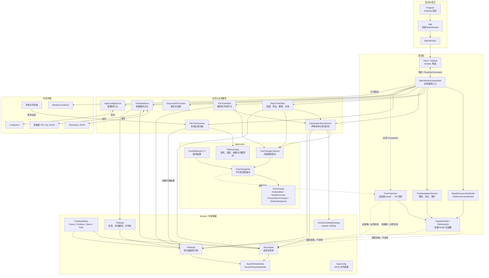
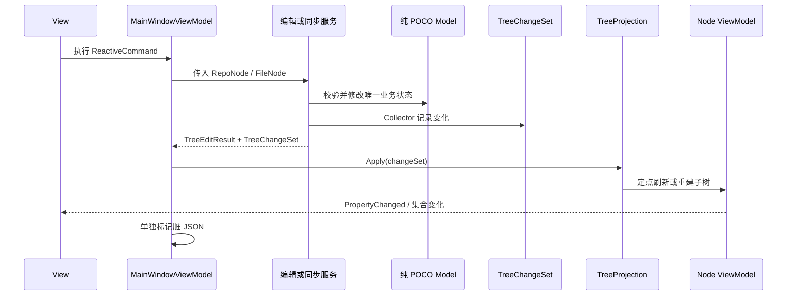
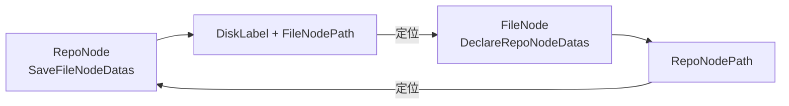

# HDD Index 架构

本文档描述当前代码已经实现的架构、运行时数据流和维护约束。它不代表未来规划。

## 设计目标

当前架构围绕以下原则组织：

- Model 是唯一业务数据源。
- Model 保持为纯 POCO，不承担 UI 通知职责。
- Services 只操作 Model，不依赖 ViewModel。
- 业务操作通过 `TreeChangeSet` 描述需要更新的投影。
- ViewModel 只保留展示数据、树节点包装和 UI 状态。
- 脏文件追踪与 UI 投影变化相互独立。
- 现有 JSON 数据格式保持向后兼容。

## 整体架构



## 目录职责

### `Models`

保存可序列化的领域数据和领域规则：

- `TreeNodeBase`
- `RepoNode`
- `FileNode`
- `FileData`
- `AppConfig`
- `DeclareHoldingStrategy`

这些类型不引用 Avalonia、ReactiveUI 或 ViewModels。`FileNode` 只保存文件树数据和声明关系，不再遍历本地文件系统。

### `Application`

`Application/TreeEditing` 定义树编辑操作与 UI 投影之间的应用层协议：

- `TreeEditResult<T>`：操作是否成功、返回值、失败原因及 ChangeSet。
- `TreeChangeSet`：一次业务操作产生的不可变变化集合。
- `TreeChangeCollector`：复杂操作内部使用的可变变化收集器。
- `TreeNodeAdded`、`TreeNodeRemoved`：细粒度结构变化。
- `TreeNodePresentationChanged`：节点展示相关数据需要重新读取。
- `FileNodeSubtreeReplaced`：文件树刷新后的子树级替换。

这些类型不参与 JSON 序列化，也不包含 Avalonia 类型。

`Application/FileScanning` 定义文件扫描边界的 UI 无关协议：

- `IFileTreeScanner`：扫描服务入口。
- `FileTreeScanRequest`：根路径、当前子树和跳过声明子树选项。
- `FileTreeScanProgress`：顶层完成数量和当前路径。
- `FileTreeScanResult`：成功、取消、完整失败或局部失败状态。
- `FileTreeScanIssue`：阻断性问题或非阻断性警告。

### `Services`

服务分为四类：

- 编辑服务：`RepoTreeEditor`、`FileTreeEditor`。
- 关系同步：`DeclarationSyncService`。
- 持久化与状态：`TreeDataStore`、`AppConfigService`、`DirtyJsonFileTracker`。
- 外部数据读取：`FileTreeScanner`。

树编辑和声明同步服务只接收 Model，并在修改完成后返回 ChangeSet。持久化服务直接读写 Model，不创建 ViewModel。

`FileTreeScanner` 通过最小的文件系统读取接口遍历本地目录。完整成功才返回可应用的 `FileNode` 根；取消、根失败或任何阻断性局部问题都不返回可应用树。隐藏属性读取失败作为非阻断性警告，目录符号链接和 Windows junction 作为阻断性问题。

### `ViewModels`

- `MainWindowViewModel`：执行命令、调用服务和扫描器、应用 ChangeSet、标记脏文件和打开对话框。
- `TreeProjection`：维护 Model 对象引用到节点 ViewModel 的会话级映射。
- `RepoNodeVM`、`FileNodeVM`：直接读取 Model 属性，只提供展示计算和变化通知。
- `RepoBrowserViewModel`、`FileBrowserViewModel`：管理选择、当前磁盘和 TreeDataGrid 数据源。
- `TreeNavigationService`：处理 ViewModel 树上的搜索、路径定位和展开。

`TreeProjection` 使用 Model 对象引用作为映射键。该身份只需要在一次应用运行期间稳定，不写入 JSON。

### `Views`

包含主窗口、对话框、行为和 AXAML。Views 通过数据绑定和 `ReactiveCommand` 与 ViewModels 交互，不直接调用业务服务。

## 树编辑时序



普通创建、删除和重命名操作使用细粒度变化。文件树刷新可能一次替换大量后代，因此使用 `FileNodeSubtreeReplaced`，保留刷新根节点的 ViewModel，仅重建其后代投影。

## Repository 与 File 双向关系



`DeclarationSyncService` 负责保证两边关系一致，包括：

- 建立声明持有关系。
- 放弃声明持有关系。
- 修改验证策略。
- Repository 节点改名后的路径更新。
- 删除节点后的关联清理。
- 文件树刷新后的关系重新验证。

## 持久化

系统不使用数据库，数据存放在 JSON 文件中：

```text
用户文档/HDD-Index/config.json
             │
             ├── Repository 树 JSON
             ├── 磁盘 A 的 File Tree JSON
             ├── 磁盘 B 的 File Tree JSON
             └── 各索引对应的本地目录
```

`DirtyJsonFileTracker` 记录发生变化的配置、Repository 树和磁盘文件树。保存时只写入被标记的文件。ChangeSet 不负责决定哪些文件需要保存。

## 依赖约束

后续修改应保持以下规则：

1. `Models` 不得引用 Avalonia、ReactiveUI 或 ViewModels。
2. `Models` 不得通过 `File`、`Directory` 等类型直接访问本地文件系统。
3. `Services` 不得引用 ViewModels。
4. ViewModel 不得复制并独立维护可变业务数据。
5. 树编辑必须通过服务修改 Model，并返回 `TreeChangeSet`。
6. `MainWindowViewModel` 负责应用 ChangeSet 和标记脏文件。
7. `TreeProjection` 是节点结构从 Model 投影到 ViewModel 的统一入口。
8. UI 展开、选择、颜色和格式化等状态留在 ViewModel。
9. JSON 属性或结构发生变化时，必须处理旧数据兼容。
10. 新增跨层依赖时，应更新或通过架构依赖测试。

## 当前限制

- 没有依赖注入容器，应用依赖由 `MainWindowViewModel` 直接组合。
- 没有通用事务回滚、撤销或重做机制。
- 文件树扫描已经从 `FileNode` 提取，但后台任务、进度窗口和扫描结果展示仍由 `MainWindowViewModel` 编排。
- `MainWindowViewModel` 仍负责服务组合、持久化和较多界面编排。
- Avalonia UI 支持跨平台，但资源管理器调用当前是 Windows 专用实现。
- 应用启动依赖默认路径下已经存在有效配置和 Repository 数据文件。
