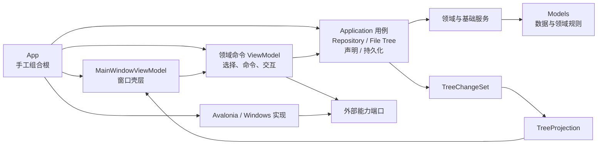

# P5 应用编排边界重构计划

本文记录 P5 的目标架构、切片依赖、范围边界和已经确认的设计决策。
[项目路线图](roadmap.md)仍是阶段状态和完成证据的唯一事实来源；
[架构文档](architecture.md)只描述已经实现的状态，并在各切片合入时同步更新。

P5.1 至 P5.6 已全部完成并合入；本文作为当时的设计依据保留。

## 背景

P5 启动时，树编辑主链路已经具备稳定边界：

- Model 是唯一业务数据源。
- 编辑与声明服务只修改 Model，并返回 `TreeChangeSet`。
- `TreeProjection` 将变化定点应用到节点 ViewModel。
- 脏文件追踪独立于 UI 投影。

P5 不替换这些机制，而是处理它们外围仍然集中的职责。启动 P5 时的问题包括：

- `FileNode` 同时保存数据和遍历本地文件系统。
- `TreeDataStore` 同时承担 JSON 持久化和从目录创建索引。
- `MainWindowViewModel` 同时加载数据、组合服务、执行应用用例、创建对话框、调度扫描、保存 JSON 和启动 Windows Explorer。
- `MainWindowViewModel` 通过 `Application.Current` 查找窗口，并成为 ViewModels 依赖具体 Views 的临时例外。
- Repository、File Tree、声明关系和持久化操作的后续步骤分散在命令处理方法中，依靠调用方手工应用 ChangeSet、修复展示状态和标记脏文件。

P5.1 移除了前两项耦合：`FileNode` 只保存数据和领域关系，`TreeDataStore`
只负责 JSON，目录遍历由独立的 `FileTreeScanner` 承担。P5.2 至 P5.6 随后完成了
外部交互、共享会话与持久化、声明、Repository 和 File Tree 用例边界；完成证据以
[项目路线图](roadmap.md#p5应用编排边界重构)为准。

## 目标架构

最终边界：

- Models 不主动访问文件系统或 JSON 序列化器，只保留可序列化数据和领域规则。
- Application 用例不依赖 Avalonia，不打开窗口，也不启动平台进程。
- 专用 ViewModel 负责 `ReactiveCommand`、当前选择、对话框交互和展示状态。
- `MainWindowViewModel` 只保留窗口级状态、导航、共享 `TreeProjection` 和子模块组合。
- 对话框、扫描进度和路径打开通过小型强类型端口提供，契约不包含 `Window`、具体 Dialog 或其他 Avalonia 类型。
- `App` 是唯一组合根，使用构造函数和手工组装，不引入依赖注入容器。
- 所有模块共享同一组 Model 对象和同一个会话级 `TreeProjection`，不复制业务状态。

## 范围和非目标

P5 除文件扫描失败的安全策略外，均为行为保持型重构。

P5 包含：

- 文件扫描、持久化、对话框和平台能力的边界提取。
- Repository、File Tree、声明关系和持久化用例的逐步拆分。
- 将 JSON 序列化和反序列化从 Model 收敛到持久化边界。
- 为新增边界建立单元测试和架构依赖测试。

P5 不包含：

- 首次启动向导、配置修复或索引恢复 UI。
- 原子保存、备份、恢复或多文件事务。
- 界面布局和交互方式改版。
- 跨平台文件管理器支持。
- 撤销、重做或新的树编辑能力。
- 依赖注入容器。

启动加载可以在 P5 中移动到会话或持久化边界，但保持当前失败行为；P4 再利用该边界提供首次启动和故障恢复。

## 切片和依赖

### P5.1：文件扫描边界

将文件系统遍历从 `FileNode` 提取为可测试的扫描服务。

范围：

- 建立 UI 无关的扫描请求、进度、结果和问题契约。
- 使用最小文件系统读取接口，确定性测试权限、I/O、取消和局部失败。
- 从 `FileNode` 移除目录遍历、隐藏属性读取、扫描进度状态和跳过子树克隆逻辑。
- 让 `TreeDataStore` 只负责 JSON，不再从本地目录创建 `FileData`。
- 新建索引和局部刷新改用扫描服务。
- 保持 JSON 格式、声明同步、`TreeChangeSet` 和 `TreeProjection` 行为不变。

本切片暂不移动 `RepoNode.CreateByJson` 和 `FileNode.CreateByJson`，也不拆分全部对话框或主 ViewModel。

实现保持了上述范围：扫描协议位于 Application 层，物理文件系统实现位于 Services 层；
`MainWindowViewModel` 暂时继续负责启动扫描、显示进度和应用成功结果，等待 P5.2
隔离这些展示与平台交互。

### P5.2：外部交互与组合根

- 为消息与确认、Repository 交互、File Tree 交互和路径打开建立小型强类型端口。
- 将具体 Dialog、扫描进度窗口和 Windows Explorer 调用移到 Avalonia 或 Windows 适配器。
- 由 `App` 显式创建并注入依赖。
- 移除 `MainWindowViewModel` 对 Views、`Application.Current` 和 `Process` 的依赖。
- 将架构测试从“只允许主 ViewModel 依赖 Views”收紧为“ViewModels 不依赖 Views”。

实现保持了上述范围：UI 无关端口位于 Application 层，Avalonia 对话框、文件夹
选择器和扫描进度窗口以及 Windows Explorer 调用位于 Adapters 层。`App` 负责加载
现有数据并显式创建服务、投影、子 ViewModel 和适配器，再通过构造函数注入主
ViewModel。ViewModels 不依赖具体 Views 或 Adapters，也不再查找
`Application.Current` 或直接启动平台进程。加载和保存的失败语义保持不变，等待
P5.3 收敛到会话与持久化边界。

### P5.3：会话与持久化边界

- 将配置和树数据加载、脏文件登记、保存编排移出主 ViewModel。
- 由会话对象持有本次运行共享的配置、Repository 根和 File Tree 集合。
- 将 `RepoNode.CreateByJson` 和 `FileNode.CreateByJson` 移入持久化实现。
- 保持现有 JSON 属性、结构、路径规则和启动失败行为。

实现保持了上述范围：`ApplicationSession` 持有本次运行共享的配置、Repository 根和
File Tree 集合，`ApplicationSessionManager` 使用逻辑目标登记脏状态并编排选择性保存，
`JsonApplicationSessionStore` 负责加载会话、解析路径和执行具体 JSON I/O。
`MainWindowViewModel` 不再直接依赖配置、树数据存储或路径型脏文件追踪器；
`RepoNode` 和 `FileNode` 也不再调用 JSON 序列化器。保存仍按配置、Repository、
File Tree 顺序执行，任一失败时保留整批脏目标；现有 JSON 格式、旧配置目录枚举、
相对路径规则和启动失败语义保持不变。

### P5.4：声明关系用例

- 提取声明持有、放弃声明和修改验证策略的 UI 无关用例。
- 用例返回验证失败、`TreeChangeSet` 和受影响持久化范围，不直接显示确认窗口。
- 展示层负责收集用户选择和确认，并应用结果。

实现保持了上述范围：`DeclarationUseCases` 通过最小的
`IDeclarationHoldingService` 端口执行建立声明、放弃声明和策略修改，统一返回
失败原因、`TreeChangeSet` 与 `PersistenceTarget`。策略修改先生成不修改 Model 的
计划和验证失败列表，展示层确认后才应用；具体对话框、消息和确认继续留在
`MainWindowViewModel` 与外部交互适配器。`DeclarationSyncService` 实现领域操作端口，
并继续为后续 Repository 与 File Tree 用例提供底层双向关系维护原语。

### P5.5：Repository 编辑用例

- 提取创建目录、复制 File 子树、重命名、删除和搜索删除用例。
- 统一业务结果、投影变化和受影响持久化范围。
- 保持当前搜索刷新、选中节点和路径导航体验。

实现保持了上述范围：`RepositoryUseCases` 通过最小的
`IRepositoryEditingService` 端口执行创建目录、复制 File 子树、重命名和删除，统一
返回失败原因、`TreeChangeSet`、建议保持选中的节点与 `PersistenceTarget`。
搜索删除先生成不修改 Model 的 `RepositorySearchDeletePlan`，展示层确认命中路径后
才应用删除。创建、重命名和删除仍会保存 Repository 与全部当前 File Tree，复制子树
仍只保存 Repository；搜索刷新、节点选择、路径导航和具体对话框继续留在
`MainWindowViewModel`。`RepoTreeEditor` 实现编辑端口，并继续复用声明同步服务维护双向关系。

### P5.6：File Tree 编辑用例与收尾

- 提取新建索引、刷新、跳过声明子树刷新、删除节点和本地路径计算用例。
- 收敛扫描服务、声明关系和持久化之间的编排。
- 将主 ViewModel 缩减为窗口级状态、导航、投影和子模块组合。
- 更新架构文档和依赖测试，确认 P5 完成标准。

实现保持了上述范围：`FileTreeUseCases` 通过 `IFileTreeScanner`、
`IFileTreeEditingService` 和 `IFileTreePathService` 编排新建索引、普通刷新、跳过声明
子树刷新、删除节点及本地路径计算。新建和刷新使用“计划、扫描、应用”三阶段流程，
计划与扫描不修改 Model；扫描取消、失败或展示层拒绝失效声明确认时不会留下半成品。
统一操作结果携带 `TreeChangeSet`、新增 `FileData` 和逻辑持久化目标，
`MainWindowViewModel` 不再直接调用文件系统、扫描器、File Tree 编辑器或声明同步服务，
只保留窗口级进度、提示、确认、选择、导航和投影应用。架构测试禁止 File Tree 用例
依赖外部交互端口，现有 JSON、AXAML 命令和用户交互保持兼容。

这些切片有明确依赖，均在前一项合入后从最新 `origin/master` 开始，不使用 stacked pull request。

## P5.1 扫描结果语义

一次扫描可以产生以下结果：

- **成功**：返回完整 `FileNode` 根节点，可以应用。
- **取消**：不返回可应用结果，不修改 Model、投影或脏文件状态。
- **失败**：根目录无法扫描或存在阻断性局部问题，不应用任何扫描结果。
- **成功但有警告**：返回完整可应用结果；应用后向用户显示一次警告摘要。

问题分为两级：

- **阻断性问题**：无法枚举目录内容、读取过程中发生 I/O 或权限错误、遇到不支持的目录重解析点等。任何一项都会让整次扫描失败。
- **非阻断性警告**：仅无法读取隐藏属性。扫描继续使用名称规则；以 `.` 开头的项目仍视为隐藏，其他项目视为可见。

错误和警告结果保留全部问题。用户界面最多展示前 20 个“路径 + 简短原因”，超出时显示剩余数量；消息正文支持滚动。

目录符号链接和 Windows junction 属于重解析点。P5.1 不递归进入这类目录，将其报告为阻断性问题，避免越过扫描根目录、重复索引或进入循环。

## P5.1 行为兼容要求

以下行为保持不变：

- 隐藏名称和 Windows Hidden 属性过滤。
- 顶层可见项目数量与完成数量进度。
- 扫描过程中的当前路径报告。
- 取消传播和取消后不修改任何业务状态。
- 跳过已声明子树时深拷贝旧索引及声明数据。
- 以大小写不敏感的名称匹配当前子树。
- 文件和目录沿用文件系统枚举顺序，不在本切片重新排序。
- 刷新根节点身份保持不变，仍通过 `FileNodeSubtreeReplaced` 更新投影。
- JSON 格式和现有 AXAML 命令绑定保持不变。

有意改变的行为只有：

- 阻断性局部问题不再被静默当作缺失节点并应用。
- 非阻断性警告在成功应用后向用户显示摘要。
- 目录重解析点不再被递归遍历。

## P5 完成标准

P5 完成不以单个类的行数为判断标准，而以职责和依赖边界为准：

- Models 不访问文件系统或 JSON 序列化器。
- ViewModels 不依赖具体 Views，不创建窗口，不查找 `Application.Current`。
- ViewModels 和 Application 用例不直接启动进程或访问平台 API。
- `MainWindowViewModel` 只承担窗口级状态、导航、共享投影和子模块组合。
- Repository、File Tree、声明关系和持久化具备独立、可测试的用例边界。
- Model 仍是唯一业务数据源，树变化仍通过 `TreeChangeSet` 和 `TreeProjection`。
- JSON 格式和现有 AXAML 命令绑定保持兼容。
- 架构依赖测试能够防止这些边界回退。

## 验证原则

每个切片：

- 为新增结果契约、应用用例和失败分支增加单元测试。
- 更新架构依赖测试，防止已移除的跨层依赖重新出现。
- 运行与 CI 等价的格式检查、Release 构建和全部测试。
- 对受影响的 UI 路径执行针对性手工验证；无法自动验证的项目在 pull request 中明确披露。
- 更新架构文档中已经实现的状态和路线图中的切片状态。
